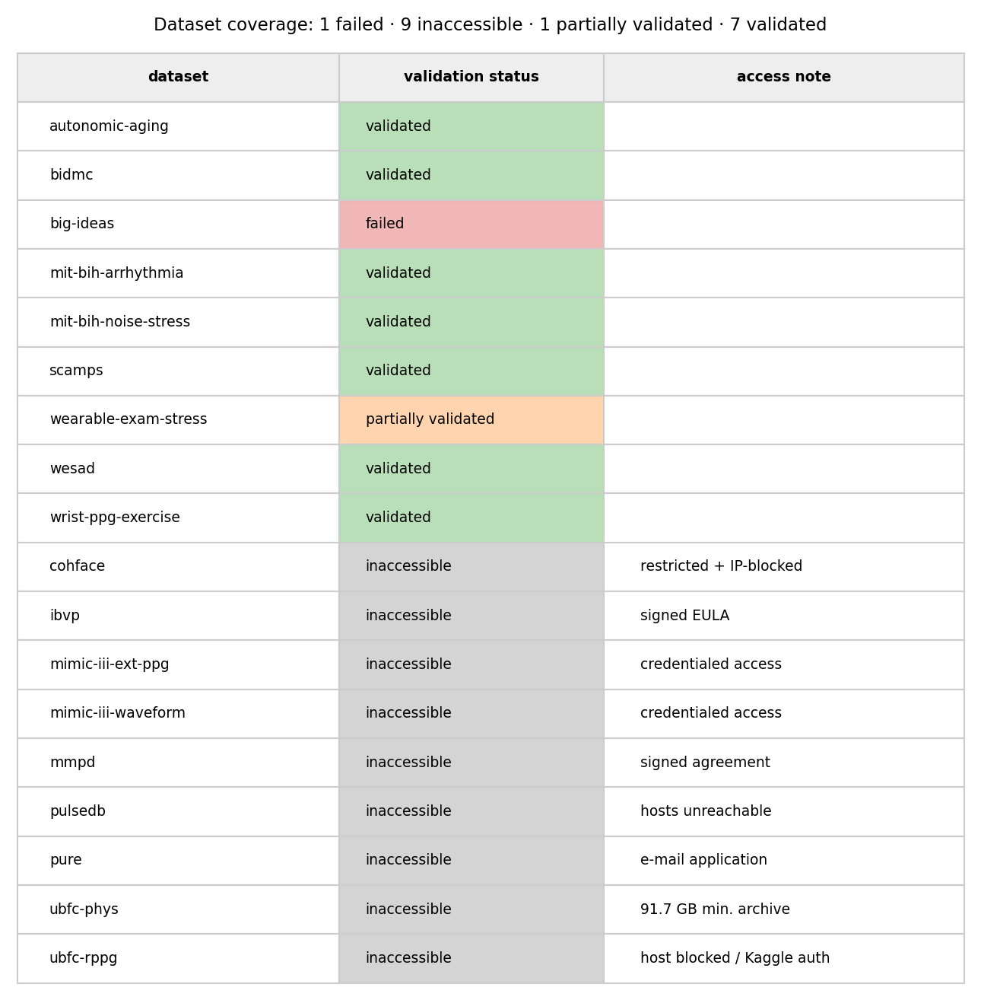
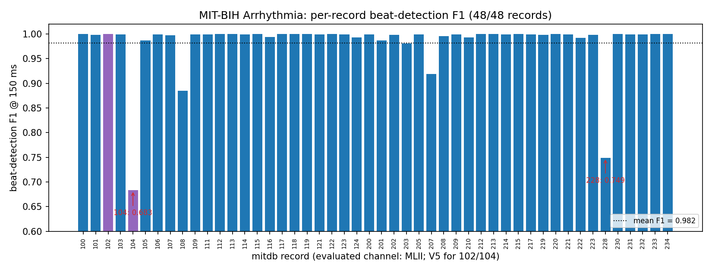
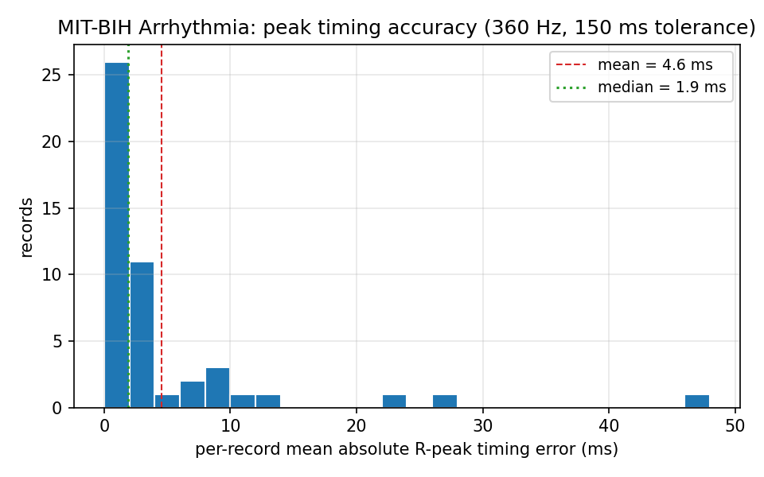
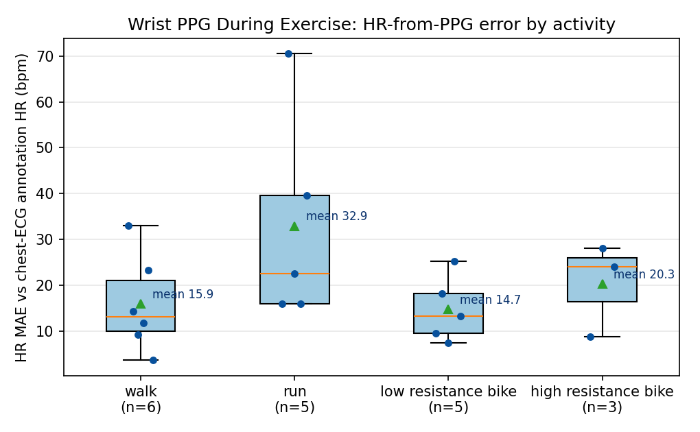
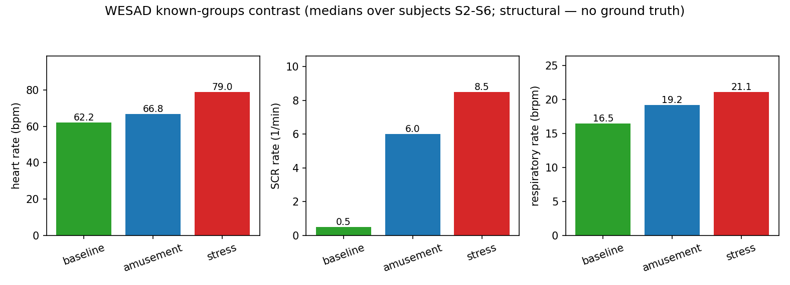
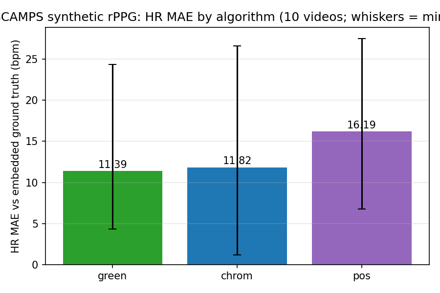
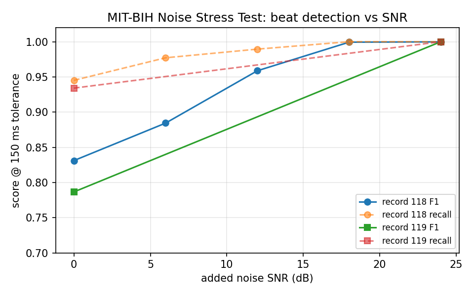

# Lamina Public-Dataset Validation Report

_Implementation under test: Lamina 0.1.0 (core `src/` identical to upstream
`main` `f3a195a`). Validation framework 0.1.0, bridge 0.1.0. All results were
produced exclusively through the `lamina_bridge` JSON bridge (see
[`architecture.md`](./architecture.md)); no Lamina source was modified. Machine
readable artifacts: `validation/results/` (consolidated) and
`validation/results/<group>/` (per-run, with per-run manifests)._

## Executive Summary

Lamina was validated empirically against 18 registered public physiological
datasets. Final status counts (verified against
`validation/results/summary.csv` and the per-dataset `datasets.json` files):

- **validated: 7** — mit-bih-arrhythmia, mit-bih-noise-stress, bidmc,
  wrist-ppg-exercise, wesad, autonomic-aging, scamps
- **partially_validated: 1** — wearable-exam-stress (BVP validated; EDA
  blocked by a confirmed Lamina sampling-rate floor)
- **failed: 1** — big-ideas (data accessible; every recording fails on the
  same confirmed Lamina `eda_clean` defect)
- **inaccessible: 9** — pulsedb, mimic-iii-waveform, mimic-iii-ext-ppg,
  ubfc-phys, pure, ubfc-rppg, cohface, mmpd, ibvp (each with a verified,
  recorded reason; see the inventory below and
  [`datasets.md`](./datasets.md))

Headline findings:

- **ECG beat detection is excellent on clean, annotated data.** On all 48
  MIT-BIH Arrhythmia records, mean F1 = **0.982** (median 0.999), precision
  0.993, recall 0.976 at a 150 ms tolerance; mean absolute R-peak timing
  error **4.6 ms** at 360 Hz; heart-rate MAE **0.93 bpm** (median 0.15).
- **Robustness degrades gracefully with calibrated noise.** On the MIT-BIH
  Noise Stress Test SNR gradient (record 118), F1 = 0.831 / 0.884 / 0.959 /
  0.999 / 1.000 at 0 / 6 / 12 / 18 / 24 dB.
- **Respiration cycle detection matches two-annotator breath references**
  on BIDMC (mean F1 0.944 at 0.5 s tolerance; inter-annotator F1 is 0.985,
  so Lamina sits close to the human agreement ceiling on 11 of 12 records).
- **Motion remains the hard case for wrist PPG.** HR-from-PPG MAE on
  wrist-ppg-exercise is 20.7 bpm overall, stratified 15.9 (walk) / 32.9
  (run) / 14.7 (low-resistance bike) / 20.3 (high-resistance bike) — an
  expected limitation of detectors without motion-artifact cancellation.
- **Autonomic known-groups physiology is reproduced.** On WESAD, stress
  minus baseline medians: HR **+16.75 bpm**, SCR rate **+8.0 /min**,
  respiratory rate **+4.64 brpm** — all in the expected direction (structural
  validation; no beat/SCR ground truth exists in the dataset).
- **Two confirmed Lamina defects were found**, both documented (never fixed)
  in [`BUGS.md`](./BUGS.md): `ecg_clean` ignores its `method` argument
  (BUG-ECG-001), `ecg-peaks` rejects `threshold_multiplier >= 1.0` with a
  wrong error message (BUG-ECG-002), plus the `eda_clean`/`eda_peaks` 5 Hz
  lowpass that fails for any fs ≤ 10 Hz (BUG-A03), which single-handedly
  accounts for the big-ideas failure and the wearable-exam-stress EDA gap.
- **HRV on arrhythmic data needs an ectopy filter Lamina does not have.**
  RMSSD from Lamina-detected beats on mitdb agrees poorly with
  annotation-derived RMSSD (MAE 313 ms) precisely because the populations
  with the most ectopy dominate the error; mean-NN agreement is good
  (MAE 33.7 ms, relative error 4.0%). See BUG-A01 and Limitations.
- **rPPG was validated on synthetic data only** (SCAMPS example set, 10
  videos × 3 algorithms, HR MAE 11.4–16.2 bpm). All six real-video rPPG
  datasets were inaccessible from the validation environment; the synthetic
  result is a correctness smoke test, not a real-world accuracy claim.

## Dataset Inventory

Status counts: **7 validated · 1 partially_validated · 1 failed ·
9 inaccessible** (18 registered). Subjects/recordings are the evaluated
counts, not the dataset totals.

| Dataset | Status | Signals | Subjects | Recordings | Validation Areas |
| ------- | ------ | ------- | -------: | ---------: | ---------------- |
| mit-bih-arrhythmia | validated | ecg | 48 | 48 | ecg-clean, ecg-peaks, hrv |
| mit-bih-noise-stress | validated | ecg | 7¹ | 7 | ecg-clean, ecg-peaks |
| bidmc | validated | ppg, rsp, ecg | 12 | 12 | ppg-clean/peaks (structural), rsp-clean, rsp-cycles, hrv |
| wrist-ppg-exercise | validated | ppg, ecg, acc | 8 | 19 | ppg-clean, ppg-peaks, ecg-peaks, hrv |
| wesad | validated | ecg, eda, bvp, rsp | 5 | 15 | ecg-peaks, ppg-peaks, eda-peaks, rsp-cycles, hrv (structural + known-groups) |
| autonomic-aging | validated | ecg | 12 | 12 | ecg-peaks, hrv (structural + population trend) |
| wearable-exam-stress | partially_validated | bvp, eda | 5 | 15 ok + 15 failed | ppg-peaks (validated); eda-clean/decompose/peaks (blocked, BUG-A03) |
| big-ideas | failed | eda | 0 | 0 ok / 2 failed | eda-clean/decompose/peaks (blocked, BUG-A03) |
| scamps | validated (synthetic) | rgb_video, bvp | 10 | 30 | rppg-algorithm, ppg-peaks |
| pulsedb | inaccessible | ppg, ecg, abp | — | — | (planned: ppg-clean, ppg-peaks) |
| mimic-iii-waveform | inaccessible | ppg, ecg, abp, rsp | — | — | (credentialed access) |
| mimic-iii-ext-ppg | inaccessible | ppg, abp | — | — | (credentialed access) |
| ubfc-phys | inaccessible | rgb_video, bvp, eda | — | — | (smallest archive 91.7 GB, exceeds timebox) |
| pure | inaccessible | rgb_video, bvp | — | — | (e-mail application required) |
| ubfc-rppg | inaccessible | rgb_video, bvp | — | — | (host blocked; Kaggle mirror needs auth) |
| cohface | inaccessible | rgb_video, bvp | — | — | (Zenodo restricted files + IP-blocked) |
| mmpd | inaccessible | rgb_video, bvp | — | — | (signed release agreement required) |
| ibvp | inaccessible | rgb_video, bvp | — | — | (signed EULA required) |

¹ nstdb rows are noise-condition re-recordings of 2 base records (118, 119);
the full SNR grid for base 118 plus both extremes for 119 were acquired
(7 of 12 annotated records; download-throttled mirror — see BUG-ECG-006).



## Methodology

**Bridge architecture.** Lamina is a Rust crate; the validation suite is
Python. All Lamina functionality is exercised through `lamina_bridge`, a
compiled Rust binary with a JSON-in/JSON-out CLI
(`--op <op> --input in.json --output out.json`, SPEC §3). Every op dispatch
is wrapped in `catch_unwind`; errors and panics return structured JSON error
envelopes with distinct exit codes, so a Lamina failure can never silently
corrupt a validation run. The Python side never re-implements signal
processing; config fields map 1:1 onto Lamina config builders and absent
fields mean "Lamina default". See [`architecture.md`](./architecture.md).

**Adapters.** One adapter per dataset
(`validation/validation/datasets/{ecg,ppg,autonomic,rppg}.py`) converts the
native format (WFDB, E4 CSV exports, MATLAB v7.3, …) into the canonical
`Signal` schema (SPEC §2) and exposes dataset-provided reference annotations
(beat annotations, breath annotations, contact-PPG references). All
validation-side assumptions (channel selection, windowing, reference-peak
extraction) live in the adapters and are documented per dataset in
[`datasets.md`](./datasets.md).

**Event matching.** Greedy one-to-one nearest-within-tolerance matching
(`validation/validation/metrics/events.py`): reference events are iterated in
ascending order; each takes the nearest not-yet-matched detection within
±tolerance; a detection matches at most one reference. Tolerances (recorded
in every run manifest):

| comparison | tolerance |
| ---------- | --------: |
| ECG/PPG beat peaks | 150 ms |
| respiratory cycles | 0.5 s |
| EDA SCR onsets | 1.0 s |

**Metrics.** Events: TP/FP/FN, precision, recall, F1, mean/median timing
error. Rates: MAE, RMSE, bias, Pearson r over aligned windows. HRV:
absolute/relative error between Lamina-detected-beat HRV and
annotation-derived HRV (kept distinct — see
[`metrics.md`](./metrics.md)). Where no defensible ground truth exists, only
**structural** metrics (peak/cycle counts, plausibility ranges, internal
consistency, known-groups contrasts) are reported and labelled as such.

**Exclusions.** Recordings whose modality failed are recorded per recording
with the exact error in `recordings.csv` and never silently dropped; dataset
status is `validated` only when all recordings succeeded. mitdb beat
references use the MIT-BIH beat symbol set only (non-beat annotations
excluded). nstdb calibration noise records (bw/em/ma) carry no beat
annotations and are excluded. WESAD subjects S1/S12 do not exist per the
dataset authors; the run evaluated S2–S6. Reference-vs-Lamina HRV is
reported separately from reference-only HRV throughout.

## Results

### ECG

**MIT-BIH Arrhythmia (mitdb), 48/48 records validated** — 30 min two-lead
ECG @ 360 Hz, expert beat annotations; evaluated channel MLII (fallback:
first channel → V5 for records 102/104).

| metric | value |
| ------ | ----- |
| beat F1 @ 150 ms | mean **0.982**, median **0.999**, min 0.683 |
| precision / recall | 0.993 / 0.976 (means) |
| mean abs R-peak timing error | **4.6 ms** mean, 1.9 ms median (360 Hz grid = 2.8 ms/sample) |
| HR MAE (windowed, vs annotation HR) | **0.93 bpm** mean, 0.15 bpm median; Pearson r 0.908 |
| HRV mean-NN (detected vs annotation beats) | MAE 33.7 ms, relative error 4.0 %, r 0.765 |
| HRV RMSSD (detected vs annotation beats) | MAE 313 ms, r 0.10 — see Limitations (no ectopy filtering; arrhythmia population) |



Weakest records (annotated in the figure): **104** (paced rhythm; evaluated
channel V5, F1 0.683 — the V2 channel of the same record scores F1 0.982;
see BUG-ECG-005) and **228** (multiform PVCs; F1 0.749, recall 0.602 — the
adaptive threshold is pulled up by tall PVCs and misses small normal beats;
with `threshold_multiplier` 0.1 the same pipeline reaches recall 0.999; see
BUG-ECG-003). The next-weakest records are 108 (0.885) and 207 (0.919).



**MIT-BIH Noise Stress Test (nstdb), 7/7 records validated** — see
Robustness below.

### PPG

**BIDMC, 12/12 recordings validated.** PPG processing runs cleanly end-to-end
on all 12 ICU recordings (mean 704 PPG peaks per 8-min recording); PPG has
no beat-level ground truth in this dataset, so PPG results are structural
(execution + plausibility) and labelled as such. The quantitative ground
truth here is respiratory (below).

**Wrist PPG During Exercise, 19/19 recordings validated (8 subjects).**
HR-from-PPG against chest-ECG annotation HR: overall MAE **20.7 bpm**
(RMSE 23.0, bias −3.1). Per activity: walk **15.9** bpm (n=6), run **32.9**
(n=5), low-resistance bike **14.7** (n=5), high-resistance bike **20.3**
(n=3) — error grows with motion intensity, the expected signature of a
classical detector without accelerometer-guided artifact rejection
(BUG-PPG-002, expected limitation). Lamina ECG peak detection on the
chest strap against dataset `.atr` annotations: mean F1 **0.877** (14 of 19
records ≥ 0.88; the tail records are the motion/morphology cases of
BUG-PPG-001/002).



### Respiration

**BIDMC, 12/12 recordings.** Breath-cycle detection vs annotator-1 breath
annotations at 0.5 s tolerance: mean F1 **0.944** (range 0.658–0.988),
precision 0.912, recall 0.992, mean abs timing error 74 ms. Context: the
two human annotators agree at F1 0.985 (inter-annotator, `metrics_extra`),
and Lamina's score is stable against the choice of annotator (F1 vs ann2
≈ F1 vs ann1). The outlier is bidmc05 (F1 0.658): a ~6 brpm ICU record with
biphasic inspiratory morphology where the peak-picking cycle detector counts
a small pre-inspiratory bump as a separate breath — not fixable via the
exposed config; the 12 s default `max_breath_interval_sec` ceiling is also
worth noting for low-RR populations (BUG-PPG-003, limitation).

### Autonomic / EDA

**WESAD, 15 recordings validated (S2–S6 × baseline/amusement/stress).** No
beat/SCR ground truth exists, so validation is structural plus a
known-groups contrast (the dataset was designed so that stress > baseline):
stress − baseline medians are HR **+16.75 bpm** (62.25 → 79.0), SCR rate
**+8.0 /min** (0.5 → 8.5), respiratory rate **+4.64 brpm** (16.5 → 21.1) —
all in the expected direction, with amusement intermediate. A cross-device
consistency check (Lamina chest-ECG HR vs Lamina wrist-BVP HR on the same
subjects) agrees within 5.8–22.4 bpm MAE.



**Autonomic Aging, 12 recordings validated.** No beat annotations;
structural run plus a population-level RMSSD-vs-age-group trend. RMSSD
medians by age stratum: young (18–39) **52.3 ms**, middle (40–69)
**24.9 ms**, old (70+) **142.8 ms** — the expected monotonic decrease with
age does **not** hold in this sample because the old stratum contains
ventricular bigeminy, and Lamina's `hrv` pipeline computes RMSSD over all
detected intervals with no ectopy/artifact filtering (BUG-A01, documented
limitation). The age trend is therefore confounded by physiology the
pipeline is (by design) not screening out.

**Wearable Exam Stress, partially_validated (5 subjects × 3 sessions).**
All 15 BVP recordings validate (Lamina `ppg-peaks` on E4 BVP @ 64 Hz). All
15 EDA recordings fail: E4 EDA is sampled at 4 Hz, and Lamina's
`eda_clean`/`eda_peaks` hardcode a 5 Hz lowpass cutoff, which is rejected
("cutoff must be strictly less than Nyquist (2 Hz)") — confirmed defect
BUG-A03. HR vs the E4's proprietary HR.csv is ambiguous (MAE 26–47 bpm raw,
26.4–38.7 on signal-active segments): the E4 reference itself contains
implausible values during seated exams, and where the E4 emits confident
inter-beat intervals, Lamina BVP IBIs agree with the E4 IBI.csv within
**28.9–45.4 ms** (BUG-A04, ambiguous — reference quality, not necessarily a
Lamina defect).

**BIG IDEAs, failed** — see Failures.

### Signal quality

Lamina's scope here is structural only: there is no public dataset in the
registry with a signal-quality ground truth, and Lamina exposes no dedicated
signal-quality index API. What was validated empirically: peak/cycle counts
stay in physiologically plausible ranges across all validated recordings
(committed in `metrics.csv` as `structural_*` rows), NaN-gap interpolation
in the wrist adapter is bounded and recorded per recording, and gross
signal-quality anomalies are *detected* as anomalies (e.g. bidmc03 ECG
near-flatline is flagged in BUG-PPG-004 and correctly attributed to the
dataset, not the detector). Quantitative signal-quality-index validation
remains future work and is listed under Limitations.

### rPPG

**SCAMPS, 30/30 recordings validated (10 synthetic videos × 3 algorithms;
synthetic-data validation — see caveat).** HR MAE vs the embedded
ground-truth PPG: **green 11.39 bpm, chrom 11.82 bpm, pos 16.19 bpm**.
chrom is the most consistent (best-case videos 1.2–2.6 bpm; peak F1 0.768).
The raw green/POS waveforms are actually excellent in magnitude (|r| 0.92 /
0.82 vs ground truth) but are emitted in inverted (intensity) phase, which
silently degrades the documented downstream `ppg-peaks` path (green peak F1
collapses to 0.245 fed as-is) — sign-convention inconsistency BUG-R01.



**Caveat.** SCAMPS videos are synthetic avatar renders with perfectly
synchronized ground truth; this validates algorithm correctness and the
bridge/windowing pipeline, not real-camera performance. All six real-video
rPPG datasets (pure, ubfc-rppg, cohface, ubfc-phys, mmpd, ibvp) were
inaccessible from the validation environment (verified reasons in the
inventory and [`datasets.md`](./datasets.md)).

## Robustness

- **Noise (nstdb SNR gradient, record 118):** F1 0.831 / 0.884 / 0.959 /
  0.999 / 1.000 at 0 / 6 / 12 / 18 / 24 dB added noise; recall is already
  0.945 at 0 dB — the F1 loss at low SNR is dominated by false positives.
  Base record 119: F1 0.787 at 0 dB, 1.000 at 24 dB.
  
- **Motion (wrist-ppg-exercise):** HR error stratifies cleanly by activity
  intensity (walk 15.9 → run 32.9 bpm MAE); foot-strike spikes at walking/
  running cadence are accepted as beats by both `ecg-peaks` and `ppg-peaks`
  (no motion-artifact rejection — expected limitation BUG-PPG-002).
  A separate threshold-adaptation failure on clean narrow-biphasic QRS
  morphology (~90 s detection blackout without recovery) is suspected as a
  defect, BUG-PPG-001.
- **Signal-quality anomalies:** bidmc03 ECG near-flatline (dataset issue,
  BUG-PPG-004); WESAD S3 baseline window with an implausibly high SCR count
  (ambiguous, BUG-A02); wrist-device dropout gaps (interpolation recorded in
  metadata). The bridge correctly fail-fast rejects non-finite input.

## Failures

Honest failure accounting (see also `validation/results/summary.csv` and the
per-run `logs/`):

- **big-ideas — failed.** Both evaluated EDA recordings (subjects 003, 015)
  fail with `Invalid cutoff frequency: Cutoff frequency (5) must be strictly
  less than Nyquist frequency (2)`: E4 EDA at 4 Hz hits the hardcoded 5 Hz
  lowpass in Lamina's `eda_clean`/`eda_peaks` (confirmed defect BUG-A03).
  The data itself is accessible and was parsed successfully; the failure is
  Lamina-side, not adapter-side. BVP/ACC modalities were out of scope
  (per-subject BVP files exceed the download budget).
- **wearable-exam-stress — partially_validated** for the same BUG-A03
  reason on its 15 EDA recordings (its 15 BVP recordings validate).
- **Inaccessible (9)** — not failures of Lamina; verified environment/legal
  barriers recorded per dataset (see inventory and
  [`datasets.md`](./datasets.md)). Notably ubfc-phys is technically
  downloadable but its smallest archive (91.7 GB) exceeds the environment
  timebox.
- **nstdb partial coverage (7 of 12 annotated records)** — dataset-scope
  note BUG-ECG-006 (throttled mirror); the SNR gradient is fully covered by
  base record 118.

## Known/Potential Bugs

Bugs are documented, never fixed, in this task. Full entries are
consolidated in [`BUGS.md`](./BUGS.md); the staged candidate lists live in
`validation/results/<group>/bug-candidates.md`. Index:

| ID | Title | Status | Severity |
| -- | ----- | ------ | -------- |
| BUG-ECG-001 | `ecg_clean` silently ignores its `method` argument | confirmed | Low |
| BUG-ECG-002 | `ecg-peaks` fails with a wrong "non-finite input" error whenever `threshold_multiplier >= 1.0` | confirmed | Medium |
| BUG-ECG-003 | Default `ecg-peaks` under-detects low-amplitude normal beats in the presence of tall PVCs (mitdb/228 recall 0.60) | suspected | Medium |
| BUG-ECG-005 | Paced-beat under-detection on mitdb/104 is strongly channel-dependent (V5 F1 0.68 vs V2 F1 0.98) | ambiguous | Low |
| BUG-ECG-006 | nstdb evaluation covers 7 of 12 records (download-throttled mirror) | dataset-issue | Informational |
| BUG-PPG-001 | `ecg-peaks` adaptive threshold blackouts (~90 s) on clean narrow-biphasic QRS morphology, no searchback recovery | suspected | Medium-High |
| BUG-PPG-002 | `ecg-peaks`/`ppg-peaks` over-count beats under periodic motion artifact (foot-strike spikes), inflating HR | limitation | Medium |
| BUG-PPG-003 | `rsp-cycles` over-detects breaths at very low respiratory rates with biphasic inspiratory morphology | limitation | Low |
| BUG-PPG-004 | bidmc03 ECG lead II near-flatline: 153 ECG vs 610 PPG beats (signal-quality anomaly) | dataset-issue | Informational |
| BUG-A01 | `hrv` op computes RMSSD over all detected intervals; no ectopy/artifact filtering (confounds age trend) | limitation | Informational |
| BUG-A02 | WESAD S3 chest-EDA baseline window shows 147 SCRs/4 min (implausibly high) | ambiguous | Low |
| BUG-A03 | `eda_clean`/`eda_peaks` hardcode a 5 Hz lowpass: any fs ≤ 10 Hz fails (blocks all Empatica E4 EDA @ 4 Hz) | confirmed | High |
| BUG-A04 | Large Lamina-vs-E4 wrist-BVP HR gap (MAE 26–47 bpm) even on signal-active segments | ambiguous | Low |
| BUG-R01 | Inconsistent output sign convention across rPPG algorithms silently degrades `ppg-peaks` HR for green/pos | suspected | Medium |
| BUG-R02 | setup-env.sh copies the bridge binary under the wrong filename | dataset-issue (framework infra) | Low |

## Limitations

- **Coverage.** 9 of 18 registered datasets are inaccessible from the
  validation environment; all real-video rPPG and all credentialed
  critical-care waveform datasets are in that set. Claims above rest on the
  9 attempted datasets only.
- **Synthetic rPPG.** SCAMPS validates algorithm correctness, not
  real-camera performance.
- **Structural vs reference validation.** WESAD, autonomic-aging, and the
  BIDMC/wrist PPG waveforms have no beat/SCR ground truth; those results are
  structural/known-groups and are labelled as such wherever they appear.
- **HRV without ectopy filtering.** Lamina's `hrv` op has no ectopy/artifact
  screen (BUG-A01). RMSSD agreement on arrhythmic populations (mitdb MAE
  313 ms, autonomic-aging old stratum) reflects ectopy-dominated intervals,
  not necessarily detector error; mean-NN agreement on the same data is
  good. RMSSD claims should be restricted to normal-sinus data.
- **Reference quality.** wearable-exam-stress HR numbers are against the
  E4's proprietary (imperfect) HR estimate; BUG-A04 stays ambiguous by
  design. BIDMC breath annotations are inspiratory-peak marks from two
  annotators (inter-annotator F1 0.985 sets the practical ceiling).
- **Sampling-rate floor.** Any EDA stream at fs ≤ 10 Hz currently cannot be
  processed (BUG-A03) — a whole device class (Empatica E4 EDA @ 4 Hz) is
  excluded until Lamina adapts its cutoff to fs.
- **Heterogeneous runs.** The consolidated results were produced by several
  runs on adapter-development branches (7 distinct commits, seeds 0/42);
  Lamina core `src/` was identical across all of them. This is recorded
  explicitly in `validation/results/manifest.json`.
- **Signal-quality validation is structural only** (no SQI ground truth, no
  dedicated Lamina SQI API).

## Reproducibility

```bash
# 1. Environment (Rust toolchain, Python deps, bridge build)
git clone <repo> && cd <repo>
sh validation/scripts/setup-env.sh "$(pwd)"

# 2. Framework self-tests (no network, no downloads)
python -m validation test

# 3. Per-dataset runs (data acquisition commands are per-group; see
#    validation/results/<group>/NOTES.md and logs/ for exact invocations)
python -m validation list
python -m validation check-access
python -m validation run --dataset mit-bih-arrhythmia --seed 42 \
    --results-dir validation/results/ecg
python -m validation run --dataset mit-bih-noise-stress --seed 42 \
    --results-dir validation/results/ecg
LAMINA_BIDMC_DIR=<bidmc data> python -m validation run --dataset bidmc \
    --seed 42 --results-dir validation/results/ppg
LAMINA_WRIST_DIR=<wrist data> python -m validation run \
    --dataset wrist-ppg-exercise --seed 42 --results-dir validation/results/ppg
python -m validation run --dataset wesad --seed 0 \
    --results-dir validation/results/autonomic
python -m validation run --dataset autonomic-aging --seed 0 \
    --results-dir validation/results/autonomic
python -m validation run --dataset wearable-exam-stress --seed 0 \
    --results-dir validation/results/autonomic
python -m validation run --dataset big-ideas --seed 0 \
    --results-dir validation/results/autonomic
python -m validation run --dataset scamps --seed 42 \
    --results-dir validation/results/rppg

# 4. Consolidate per-group results into the canonical top-level artifacts
python -m validation.consolidate            # writes validation/results/{summary,recordings,metrics}.csv, datasets.json, manifest.json

# 5. Figures for this report
python3 docs/validation/figures/generate_figures.py
```

Exact code/data/parameter versions per run: `validation/results/manifest.json`
(umbrella) → per-run `validation/results/<group>/…/manifest.json` (git
commit, branch, seed, tolerances, package versions, UTC timestamps).
